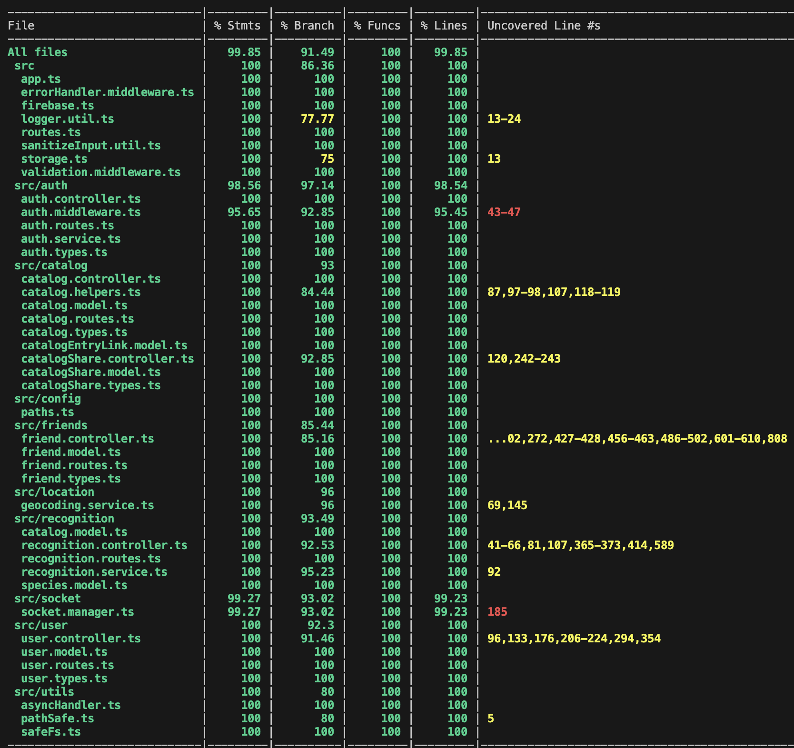

# BioTrack Backend Coverage

## Coverage Dashboards

### Unmocked Suites

### Mocked Suites

### Combined Report

Refer to `documentation/Testing_And_Code_Review.md` for explanations of the remaining uncovered branches and the commands used to produce each screenshot.
