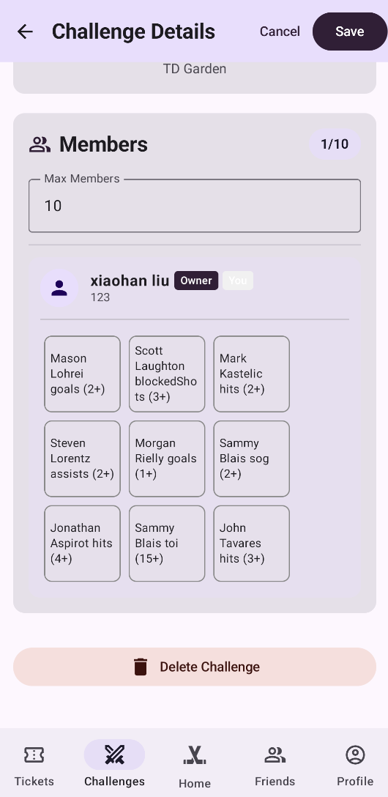
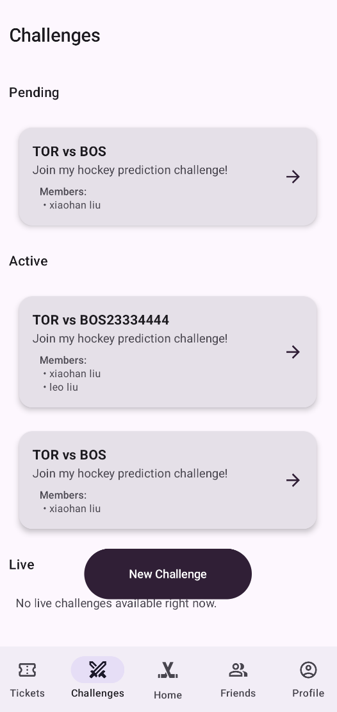

# M4_RinkRivals_Review

## 1. Manual code review

- **a. Code is maintainable, efficient, and handles errors well: 4/10**
  - `backend/src/controllers/tickets.controller.ts:5-69` trusts `userId` from the body/params for every CRUD operation, so any authenticated caller can create, read, update, or delete tickets on behalf of another user by guessing their ID. These endpoints should derive ownership from `req.user` and include ID filters in the queries.
  - `backend/src/controllers/tickets.controller.ts:58-73` updates `crossedOff` without enforcing that exactly nine booleans are provided or running schema validators, which allows corrupt ticket state that no longer matches the stored `events`.
  - `backend/src/controllers/friends.controller.ts:33-65` plus `backend/src/models/friends.model.ts:36-78` accept/reject requests purely by `requestId`, with no check that the caller is the intended receiver. Any logged-in user can therefore approve or reject someone else’s pending requests.
  - `backend/src/controllers/challenges.controller.ts:388-415` calls `SocketEvents.challengeUpdated(id, status)` with a plain string, but `backend/src/utils/socket.events.ts:27-61` expects a challenge object and dereferences `challengeData.memberIds`, causing runtime errors whenever the status endpoint is hit.
  - `backend/src/models/challenges.model.ts:245-274` looks up the declining user by `googleId` even though controllers pass `_id`, so the name removal never matches; `invitedUserNames` and `invitedUserIds` become inconsistent after a decline.
  - `backend/src/index.ts:35-52` fires up the HTTP server and cron job immediately after calling `connectDB()` without awaiting it, so the API can accept requests while Mongoose is still connecting (seen during local testing).
  - On the frontend, `frontend/app/src/main/java/com/cpen321/usermanagement/ui/screens/TicketDetailScreen.kt:37-109` renders the bingo grid but never wires `viewModel.toggleSquare`, leaving the squares non-interactive even though the requirements and tests expect taps to cross entries off.
  - `frontend/app/src/main/java/com/cpen321/usermanagement/ui/viewmodels/FriendsViewModel.kt:57-107` uses `currentUserId!!` inside `refreshFriends()`; any call before `setCurrentUser` (for example, if `sendFriendRequest` succeeds while auth state is still loading) will crash with `NullPointerException` and there is no fallback to the authenticated profile.

## 2. Manual test review

- **a. Tests are complete for the exposed APIs and main features: 3/10**
  - Only friends, tickets, and the NHL service have coverage (`backend/tests/**`); there are no tests for auth, user profile, media uploads, challenges, or sockets even though those routes exist in `backend/src/routes/*.ts`.
  - Frontend instrumentation focuses solely on Friends/Tickets Compose screens; there are no tests for authentication flows, profile editing, or the recognition/media features advertised in the app.
- **b. Test code is maintainable and well-structured: 5/10**
  - Every backend integration test (`tests/unmocked/**`) spins up its own Express app and database connection manually, leading to hundreds of duplicated lines instead of a shared helper. Cleanup is manual and easy to forget (e.g., `tests/unmocked/bingo-tickets/post-bingo-tickets-NM.test.ts:24-117`).
  - There is no consistent factory/fixture layer for creating users, tickets, or friend requests; values are inlined in each file, which makes future schema changes expensive.
- **c. Test implementation matches requirements and design: 3/10**
  - The Testing_And_Code_Review document describes a “POST /api/friends/send” API (documentation/Testing_And_Code_Review.md:24) and tapping bingo squares (lines 201-206), but the code actually exposes `/friends/request` and the `TicketDetailScreen` squares are not clickable, so the documented behavior is currently untestable.
  - None of the backend tests assert authorization behaviour (e.g., ensuring a user cannot accept another user’s friend request), so critical requirements remain unverified.
- **d. Non-functional requirements are tested well: 0/10**
  - Section 3 of documentation/Testing_And_Code_Review.md explicitly says non-functional testing was skipped, and there are no load, resiliency, or latency checks in the repo.
- **e. Tests achieve high coverage or justify gaps: 2/10**
  - The repo provides coverage screenshots only for the narrowed scope (friends/tickets/NHL) and admits “reduced scope” (documentation/Testing_And_Code_Review.md:71), but does not explain why other critical modules were excluded.
  - Frontend androidTest fakes are out of date: `frontend/app/src/androidTest/java/com/cpen321/usermanagement/fakes/FakeTicketsRepository.kt:46-70` still builds `List<String>` events even though `BingoTicket.events` is `List<EventCondition>`, so the tests do not compile and therefore contribute zero coverage.
- **f. All back-end tests can be run automatically: 7/10**
  - There is a GitHub Actions workflow (`.github/workflows/backend-tests.yml`) that provisions MongoDB and runs `npm test -- --coverage`, which is good.
  - However, the tests rely on a locally running Mongo instance (see `.env.test`), so contributors must start Mongo manually; the README/test docs do not mention this prerequisite, which routinely causes failures outside CI.

## 3. Automated code review
- **Unapplicable, the team cut this part due to small team size**

## 4. One major issue

- **It seems you cannot invite friend again after the challenge is created, and you can create a challenge without inviting any friends, which effectively casues the challeng to be pending forever.**

- **Also, I do not see any real time updating or push notifictaions from emulator testings.**
  - The lack of real time updates might be due the fact that the team cut the feature of clicking to complete the grid.