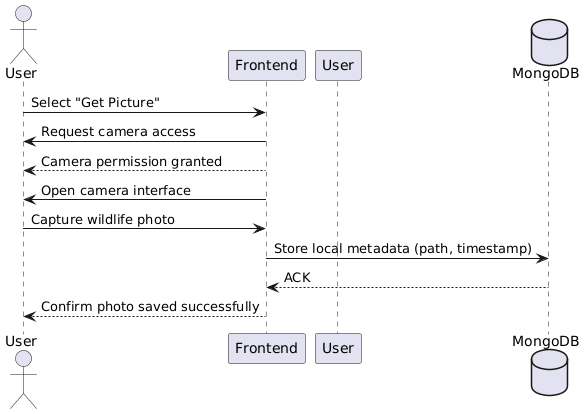
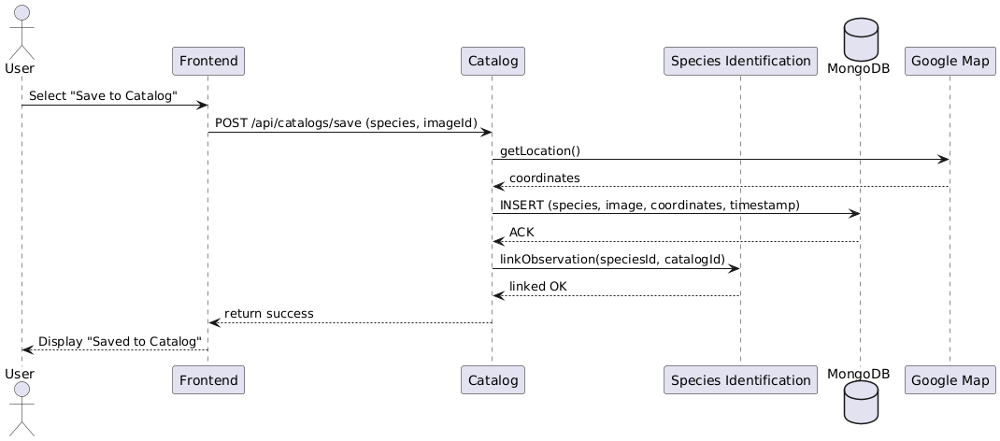

# Requirements and Design

## 1. Change History

|**Change Date**|    **Modified Sections**    |     **Rationale**       |
|---------------|  ---------------------      |-------------------------|
| 27/10/25 | 4.1; Species Identification Removed caching data logic |fetching from api is not too slow |
| 13/10/25 | Changed non-functional req | old functional req were not specific enough |
| 27/10/25 | 3.1; Changed where share catalog was mentioned | did this to align with the friends use case | 
| 27/10/25 | 3.2; added colour coding and changed ordering of some use cases | did this to make it clear what use case is for what feature |
| 27/10/25 | added Google Map Api to Use case diagram and described more accuratly where it is used in the use case descriptions | use of the google maps api was unclear in previous documentation |
| 27/10/25 | updated dependency diagram to show google maps api in frontend as well as firebase | this more accuratly represents our application |

## 2. Project Description

BioTrack – Wildlife Scanner & Collection App

BioTrack is designed for hikers, tourists, birdwatchers, animal lovers, and scientists such as botanists, entomologists, and zoologists. These users often encounter plants, animals, or insects in the wild but struggle to identify and document them in a structured, accessible way. Existing solutions are either fragmented (separate apps for plants, birds, or insects) or too technical for casual users.

The project aims to bridge this gap by providing a simple yet powerful mobile app that allows users to scan and identify wildlife instantly and store observations in personal or shared catalogs. This helps both casual explorers and professional researchers keep track of biodiversity, share findings with friends or collaborators, and learn more about the natural world around them.

---

## 3. Requirements Specification

### **3.1. List of Features**
1. **Authentication**: To access the app, a user must sign in using the Google authentication service. New users should sign up before signing in. An authenticated user can sign out. Users can also remove their account.
2. **Wildlife Recognition**: A user can scan and recognize wildlife using their devices camera. The app uses an external API to process the image and identify the wildlife species. When identified, the user can see basic information about the wildlife, like its name, habitat, rarity etc. The user can then catalog the species.
3. **Catalog**: A user can create a catalog and save scanned wildlife to the catalog. Each entry contains information about the species and when and where the species was scanned. Users can make multiple catalogs as well as share catalogs with friends, where they can catalog entries in real time.
4. **Manage Friends**: A user can add friends by searching for their username. A user can view their friends list, accept friend requests and remove friends. Based on species catalogged by a user, friend reccommendations will be suggested to the user based on catalog similarity to other users. Users can share scanned wildlife and catalogs with friends

### **3.2. Use Case Diagram**

### **3.3. Actors Description**
1. **User**: The primary actor who interacts with the BioTrack app. Users can scan wildlife, view identifications, save observations to catalogs, manage their collections, and optionally share findings with friends or collaborators.
2. **External Authentication Service**: A third-party provider that verifies a user’s identity and manages secure login and account syncing across devices.
3. **External Image Recognition Service**: An API that processes photos uploaded by the user and returns likely species identifications along with confidence scores.
4. **Push Notification Service**: A cloud-based service that delivers real-time alerts to users such as friend activity updates.

### **3.4. Use Case Description**
- Use cases for feature 1: Authentication
1. **Sign-Up**: Create an account by registering with google authentication API before accessing the app.
2. **Sign-In**: An existing user logs into the app using their google account to access features
3. **Create Profile**: an existing user can create a profile connected to their google account to store catalogs and friends.
4. **Sign-Out**: The user logs out of the app by logging out of their google account
5. **Remove Account**: the user deletes their google account from the app.
- Use cases for feature 2: Wildlife Recognition
6. **Get Picture**: The user takes a photo of wildlife using the apps camera feature or uploads a photo already in device storage.
7. **Scan Picture**: The app scans the picture and identifies the wildlife and description of the wildlife (eg. species type, mammel, rarity, endarngered) using an external recognition API.
- Use cases for feature 3: Catalog
8. **Create Catalog**: The user creates a personal collection to store the picture taken of the wildlife as well as the time and location of the sighting and the description of the wildlife and organize by species encountered wildlife. The user can title catalogs and make mulitple catalogs
9. **Delete Catalog**: The user deletes their catalog, permanently removing all stored encounters in said catalog.
10. **Edit Catalog**: The user can edit their catalog name, and remove entries from the catalog.
11. **Catalog Scanned Picture**: After scanning, the user saves the identified species along with the time and location of the sighting via google maps as well as a description of the species to their catalog. 
- Use cases for feature 4: Manage Friends
12. **Add Friends**: The user can send or accept friend requests to connect with other app users. Users can search for usernames to add friends as well as remove friends from their friendslist. When users search for friends, there will be a reccommended list of friends the user can add based on catalog similarity.
13. **Share Catalog**: The user can share one or multiple of their catalogs with friends. Friends can view the catalog or, if the catalog owner gives permission for collaboration, friends can contribute their own pictures to the catalog. The owner of the catalog can revoke collaboration permissions and remove friends from a catalog at any time.
14. **Share Scanned Picture**: The user can share a single scanned wildlife picture as well a brief description of the scanned wildlife directly with friends. The users friends will get a push notification when a scanned picture is shared with them.

### **3.5. Formal Use Case Specifications (5 Most Major Use Cases)**

#### Use Case 1: Get Picture

**Description**: The user takes a photo of wildlife using the apps camera feature or uploads a photo already in device storage.

**Primary actor(s)**: User 

**Preconditions**: The user is logged into the app and camera permissions are granted.

**Postconditions**: A photo is successfully taken and stored in device storage, ready for scanning.
    
**Main success scenario**:
1. The user selects the “Get Picture” option.
2. The app opens the built in camera function.
3. The user points the camera at wildlife and captures a photo.
4. The system confirms the photo was taken and stores it for further processing.

**Failure scenario(s)**:
- 1a. Camera permissions are denied.
    - 1a1. The system prompts the user to enable permissions in settings.

- 2a. The user cancels without taking a photo.
    - 2a1. The system returns to the previous screen without saving anything.
                
- 4a. Device storage is full.
    - 4 a1. The system displays an error message and discards the photo.

#### Use Case 2: Scan Picture

**Description**: The system analyzes the uploaded photo and identifies the wildlife using an external recognition API.

**Primary actor(s)**: User 

**Preconditions**: The user has a photo stored in device storage.

**Postconditions**: The identified wildlife and metadata are displayed to the user.
    
**Main success scenario**:
1. The user selects “Scan Picture.”
2. The system sends the picture to the external recognition API and returns the identification.
3. The system displays the species name, picture, and description (eg. species type, mammel, rarity, endarngered).

**Failure scenario(s)**:
- 1a. No internet connection.
    - 1a1. The system displays an error and asks the user to reconnect.

- 2a. The API cannot recognize the wildlife.
    - 2a1. The system displays a message: “Species not found,” with an option to retry.
                
- 2b. API request times out.
    - 2b1. The system prompts the user to retry scanning later.

#### Use Case 3: Catalog Scanned Picture

**Description**: After scanning, the user saves the identified species along with the time and location of the sighting as well as a description of the species to their catalog.

**Primary actor(s)**: User

**Preconditions**: The user has successfully scanned a picture and received identification results.

**Postconditions**: The wildlife and encounter details are stored in the catalog.
    
**Main success scenario**:
1. The user chooses “Save to Catalog.”
2. The system adds the entry (species + description) to the user’s catalog.

**Failure scenario(s)**:
- 1a. User does not have a catalog.
    - 1a1. The system prompts the user to create a catalog.

- 2a. User cancels before saving
    - 2a1. The system discards the scanned entry.
                
- 2b. Device storage or database write fails.
    - 2b1. The system displays an error message and does not save the entry.

#### Use Case 4: Add Friends

**Description**: The user can send or accept friend requests to connect with other app users. Users can search for usernames to add friends as well as remove friends from their friendslist. When users search for friends, there will be a reccommended list of friends the user can add based on catalog similarity.

**Primary actor(s)**: User 

**Preconditions**: The user is logged into the app.

**Postconditions**: The friend request is sent or accepted, and the new friend is added to the user’s friend list.
    
**Main success scenario**:
1. The user selects “Add Friend.”
2. The system prompts the user to enter a friend’s username.
3. The system searches and locates the account.
4. The user sends a friend request.
5. The recipient accepts the request.
6. Both users see each other in their friend lists.

**Failure scenario(s)**:
- 1a. No input provided.
    - 1a1. The system displays an error: “Please enter a username.”

- 2a. No account matches the input.
    - 2a1. The system displays: “No user found.”
                
- 3a. Recipient rejects or ignores request.
    - 3a1. The system informs the sender that the request was not accepted.

#### Use Case 5: Share Scanned Picture

**Description**: The user can share a single scanned wildlife picture as well a brief description of the scanned wildlife directly with friends. The users friends will get a push notification when a scanned picture is shared with them.

**Primary actor(s)**: User 

**Preconditions**: The user has at least one scanned picture in their collection.

**Postconditions**: The shared picture is sent, and friends can view it from a push notification.
    
**Main success scenario**:
1. The user selects a scanned picture from their catalog.
2. The user chooses the option “Share with Friends”
3. The system displays the users list of friends.
4. The user selects recipient(s) and confirms sharing.
5. The system sends notifications to the selected friend(s).
6. Recipients view the shared picture and its details.

**Failure scenario(s)**:
- 1a. User cancels before confirming share.
    - 1a1. The system aborts the operation.

- 2a. No friends or groups are selected.
    - 2a1. The system displays an error message: “Please select at least one recipient.”
                
- 3a. Notification delivery fails.
    - 3a1. The system retries sending, or displays an error if unsuccessful.

### **3.7. Non-Functional Requirements**

1. **Recognition Latency**
    - **Description**: The app must return wildlife recognition results within ≤ 10 seconds for [alomst] all scans.
    - **Justification**: Real-time wildlife identification is a core value proposition; if results take too long, the app feels unusable in outdoor/field settings. The 10-second threshold balances API response times, network variability, and user patience. (https://www.nngroup.com/articles/response-times-3-important-limits/)
2. **UI/UX Accessibility**
    - **Description**: The apps UI/UX should be easily accessible for [almost] all our users.
    - **Justification**: The goal of this app is to provide a simplified, easy way for users to scan, keep track of and learn about different wildlife they come across. So our UI/UX should be accessible to a wide range of users. (https://www.freecodecamp.org/news/why-accessibility-matters-in-ui-ux-design/).
3. **Privacy & Data Protection**
    - **Description**: All personal data (friend lists, catalog entries, location metadata) must be stored securely in the cloud database with encryption. Users must be able to delete all their data upon account removal.
    - **Justification**: We have to made sure the application is complient with canadian data protection laws (https://www.priv.gc.ca/en/privacy-topics/privacy-laws-in-canada/the-personal-information-protection-and-electronic-documents-act-pipeda/pipeda_brief/). This means only data from a user that is absolutly neccessary is collected and a user can delete all their data from the app at any time.

---

## 4. Designs Specification
### **4.1. Main Components**
1. **Species Identification**
    - **Purpose**: Receives an uploaded photo and returns the most likely species with confidence scores and metadata. It abstracts over multiple image recognition APIs.
    - **Interfaces**: 
        1. **POST /api/recognition**
            - **Purpose**: Accepts an image from the client and returns species predictions with confidence and metadata.
            - **Parameters**: file image (The uploaded image file).
            - **Returns**: 
            {
                "message": "Species recognized successfully",
                "data": {
                    "species": {
                        "id": 12345,
                        "scientificName": "Corvus brachyrhynchos",
                        "commonName": "American Crow",
                        "rank": "species",
                        "taxonomy": "Aves",
                        "wikipediaUrl": "https://en.wikipedia.org/wiki/American_crow",
                        "imageUrl": "https://..."
                    },
                    "confidence": 0.91,
                    "alternatives": [
                    {
                        "scientificName": "...",
                        "commonName": "...",
                        "confidence": 0.42
                    }
                    ]
                }
            }
        2. **Recognition Result recognizeFromUrl(imageUrl: string)**
            - **Purpose**: Internal server method that queries iNatuarlist and zylalabs and returns more confident result.
            - **Parameters**: Image image
            - **Returns**: 
            {
                "message": "Species recognized successfully",
                "data": {
                    "species": {
                        "id": 12345,
                        "scientificName": "Corvus brachyrhynchos",
                        "commonName": "American Crow",
                        "rank": "species",
                        "taxonomy": "Aves",
                        "wikipediaUrl": "https://en.wikipedia.org/wiki/American_crow",
                        "imageUrl": "https://..."
                    },
                    "confidence": 0.91,
                    "alternatives": [
                    {
                        "scientificName": "...",
                        "commonName": "...",
                        "confidence": 0.42
                    }
                    ]
                }
            }

2. **Catalog**
    - **Purpose**: Creates and manages a user’s catalog of sightings, and maintains a list of unique species seen. Keeps domain logic server-side for consistency and offline-friendly syncing; cleaner than pushing all logic to the client.
    - **Interfaces**: 
        1. **POST /api/catalogs**
            - **Purpose**: Adds a new species sighting to the user’s catalog.
            - **Parameters**: _id, name, description, owner, createdAt, updatedAt, entries
            - **Returns**: 
            {
                "message": "Entry linked to catalog successfully",
                "data": {
                    "catalog": {
                        "_id": "...",
                        "name": "Spring Birds",
                        "description": "...",
                        "owner": "...",
                        "createdAt": "...",
                        "updatedAt": "...",
                        "entries": [
                             {
                            "entry": {
                                "_id": "...",
                                "userId": "...",
                                "speciesId": {
                                    "_id": "...",
                                    "scientificName": "Corvus brachyrhynchos",
                                    "commonName": "American Crow",
                                     "...": "..."
                                },
                                "confidence": 0.91,
                                "latitude": 49.28,
                                "longitude": -123.12,
                                "imageUrl": "/uploads/images/....jpg",
                                "notes": "Perched on cedar tree",
                                "createdAt": "...",
                                "updatedAt": "..."
                            },
                            "linkedAt": "2024-05-01T19:30:00.000Z",
                            "addedBy": "..."
                        }
                        ]
                    }
                }
            }
        2. **GET /api/catalogs/**
            - **Purpose**: Lists all catalogs owned by the authenticated user.
            - **Parameters**: Bearer JWT
            - **Returns**: Array of catalogs with metadata and entry counts.

3. **User**
    - **Purpose**: Handles user profiles, OAuth login, friends.
    - **Interfaces**:
        1. **POST /api/auth/signup**
            - **Purpose**: Register a new user using a Google ID token and return JWT + profile.
            - **Parameters**: idToken: string
            - **Returns**:
            {
                "message": "User signed up successfully",
                "data": { "token": "jwt-token", "user": { "_id": "...", "email": "...", "name": "..." } }
            }
        2. **POST /api/auth/signin**
            - **Purpose**: Log in an existing user and return JWT + profile.
            - **Parameters**: idToken: string
            - **Returns**:
            {
                "message": "User signed up successfully",
                "data": { "token": "jwt-token", "user": { "_id": "...", "email": "...", "name": "..." } }
            }
        3. **GET /api/user/profile**
            - **Purpose**: Retrieve the authenticated user’s profile.
            - **Parameters**: Authorization: Bearer <JWT>
            - **Returns**: User profile object (name, email, stats).
        4. **POST /api/user/profile**
            - **Purpose**: Update user profile fields.
            - **Parameters**: Authorization: Bearer <JWT>, Request Body: { name?, username?, location?, region?, isPublicProfile?, favoriteSpecies?[] }
            - **Returns**: Updated profile object.
        5. **DELETE /api/user/profile**
            - **Purpose**: Permanently delete the user’s account.
            - **Parameters**: Authorization: Bearer <JWT>
            - **Returns**: { "message": "User deleted successfully" }

### **4.2. Databases**
**MySQL (self-hosted on cloud VM)**
    - **Purpose**: Primary relational store: `users`, `sessions`, `friends`, `species`, `sightings`, `photos`. Chosen over MongoDB to benefit from strong relational integrity for joins (e.g., user<-->sightings, species<-->sightings).

### **4.3. External Modules**
1. **iNaturalist / Pl@ntNet / Kindwise (image Recognition APIs)**
    - **Purpose**: Perform image-based species identification and return candidate species with scores; we normalize these to a unified schema. We believe domain-trained models outperform generic vision APIs; avoids training our own model within course scope.
2. **Google Map**
    - **Purpose**: Display and record locations. Mature SDKs, reliable tiles, and strong mobile support.
3. **Firebase Cloud Messaging**
    - **Purpose**: Push notifications for friend requests and catalog sharing.
4. **Google Authentication**
    - **Purpose**: Create accounts and manage login.

### **4.4. Frameworks**
1. **Android (Kotlin) + Jetpack Compose + CameraX**
    - **Purpose**: Native UI and camera capture that meet course constraints; Compose for UI, CameraX for image acquisition.
    - **Reason**: Compliant to syllabus.
2. **Node.js (TypeScript) + Express**
    - **Purpose**: Implement the RESTful APIs with typing and middleware ecosystem.
    - **Reason**: Compliant to syllabus, easy to test and deploy.
3. **Azure Virtual Machine (Ubuntu) + Docker**
    - **Purpose**: Cloud deployment of the Node/TS services and MySQL database on a self-managed VM; Nginx for TLS termination and static photo serving.
    - **Reason**: Cloud is required and free Azure service can be requested from course staff. Docker simplifies reproducible grading.
4. **GitHub Actions**
    - **Purpose**: Build/test pipelines for Android app and Node back end; push Docker images and perform zero-downtime deploys.
    - **Reason**: Streamlines deployment, improves efficiency.

### **4.5. Dependencies Diagram**

### **4.6. Use Case Sequence Diagram (5 Most Major Use Cases)**
1. [**Get Picture**](#uc1)\

2. [**Scan Picture**](#uc1)\

3. [**Catalog Scanned Picture**](#uc1)\

4. [**Add Friends**](#uc1)\

5. [**Share Scanned Picture**](#uc1)\

### **4.7. Design and Ways to Test Non-Functional Requirements**
1. [**Recognition Latency**](#nfr1)
    - **Validation**: The backend uses asynchronous Express routes with non-blocking I/O to ensure fast responses. We can test the total response time between image upload and recognition result using Postman load tests
2. [**UI/UX Accessibility**](#nfr1)
    - **Validation**: The frontend uses semantic UI elements and and clear color contrast. We can perform user testing to ensure key tasks remain intuitive and consistent.
3. [**Privacy & Data Protection**](#nfr1)
    - **Validation**: JWT tokens secure user sessions, and Google OAuth 2.0 ensures authentication without storing raw passwords. The backend provides a dedicated /api/user/profile (DELETE) endpoint to permanently remove user data, complying with PIPEDA principles.