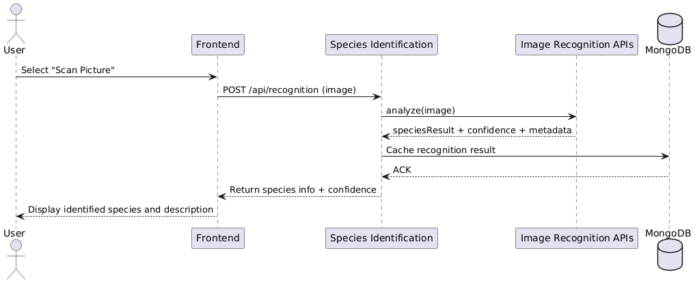
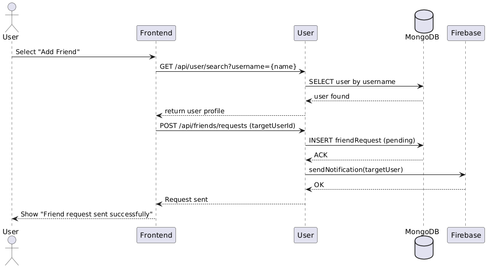

# Requirements and Design

## 1. Change History

| **Change Date** | **Modified Sections** | **Rationale** |
| --- | --- | --- |
| 27/10/25 | 4.1 | Consolidated components into species identification, catalog, and user groupings as per design review. |
| 27/10/25 | 3.7, 4.1, 4.2, 4.3, 4.4, 4.6, 4.7 | Documented component interfaces, refreshed technology selections, and tied sequence/NFR sections to the implemented code. |
| 27/10/25 | 4.1 (Species Identification) | Removed caching data logic because calling the API on demand already meets the latency target. |
| 27/10/25 | 3.2 | Added colour coding and changed use-case ordering to clarify which feature each scenario supports. |
| 27/10/25 | 3.1 | Adjusted shared-catalog references so that the flow matches the friends feature. |
| 27/10/25 | 3.1, 3.2 | Highlighted Google Maps API usage in the use-case diagram and descriptions to make location handling explicit. |
| 27/10/25 | 4.5 | Updated the dependency diagram to include Google Maps API on the frontend alongside Firebase. |
| 13/10/25 | 3.7 | Replaced vague non-functional requirements with specific, measurable statements. |
| 26/11/25 | 3.3 | Added google maps service as an actor to be consistent with use case diagram |
| 26/11/25 | 3.4 | Added search for friends use case as the Add Friends use case was too coarse grained and needed to be split up |
| 26/11/25 | 3.4 | Added Remove Friends use case. Once again, add friends was too coarse grained and needed to be split |
| 26/11/25 | 3.4 | Added Edit shared catalog permissions use case. Key functionalitiy of the manage friends feature in our app that wasn't documented |
| 26/11/25 | 3.4 | Removed Share scanned image use case. Wasn't something that we decided to implement in the app so removed it |
| 26/11/25 | 3.2 | Updated use case diagram to match changes made to use cases |
| 26/11/25 | 3.5 | Made minor change to formal use case spec based on M2 feedback |

## 2. Project Description

BioTrack – Wildlife Scanner & Collection App

BioTrack is designed for hikers, tourists, birdwatchers, animal lovers, and scientists such as botanists, entomologists, and zoologists. These users often encounter plants, animals, or insects in the wild but struggle to identify and document them in a structured, accessible way. Existing solutions are either fragmented (separate apps for plants, birds, or insects) or too technical for casual users.

The project aims to bridge this gap by providing a simple yet powerful mobile app that allows users to scan and identify wildlife instantly and store observations in personal or shared catalogs. This helps both casual explorers and professional researchers keep track of biodiversity, share findings with friends or collaborators, and learn more about the natural world around them.

---

## 3. Requirements Specification

### **3.1. List of Features**
1. **Authentication**: To access the app, a user must sign in using the Google authentication service. New users should sign up before signing in. An authenticated user can sign out. Users can also remove their account.
2. **Wildlife Recognition**: A user can scan and recognize wildlife using their devices camera. The app uses an external API to process the image and identify the wildlife species. When identified, the user can see basic information about the wildlife, like its name, habitat, rarity etc. The user can then catalog the species.
3. **Catalog**: A user can create a catalog and save scanned wildlife to the catalog. Each entry contains information about the species and when and where the species was scanned. Users can make multiple catalogs as well as share catalogs with friends, where they can catalog entries in real time.
4. **Manage Friends**: A user can add friends by searching for their username. A user can view their friends list, accept friend requests and remove friends. Based on species catalogged by a user, friend reccommendations will be suggested to the user based on catalog similarity to other users. Users can share scanned wildlife and catalogs with friends

### **3.2. Use Case Diagram**

### **3.3. Actors Description**
1. **User**: The primary actor who interacts with the BioTrack app. Users can scan wildlife, view identifications, save observations to catalogs, manage their collections, and optionally share findings with friends or collaborators.
2. **External Authentication Service**: A third-party provider that verifies a user’s identity and manages secure login and account syncing across devices.
3. **External Image Recognition Service**: An API that processes photos uploaded by the user and returns likely species identifications along with confidence scores.
4. **Google Maps Service**: An API that saves a users location using the phones built-in GPS.
5. **Push Notification Service**: A cloud-based service that delivers real-time alerts to users such as friend activity updates.

### **3.4. Use Case Description**
- Use cases for feature 1: Authentication
1. **Sign-Up**: Create an account by registering with google authentication API before accessing the app.
2. **Sign-In**: An existing user logs into the app using their google account to access features
3. **Create Profile**: an existing user can create a profile connected to their google account to store catalogs and friends.
4. **Sign-Out**: The user logs out of the app by logging out of their google account
5. **Remove Account**: the user deletes their google account from the app.
- Use cases for feature 2: Wildlife Recognition
6. **Get Picture**: The user takes a photo of wildlife using the apps camera feature or uploads a photo already in device storage.
7. **Scan Picture**: The app scans the picture and identifies the wildlife and description of the wildlife (eg. species type, mammel, rarity, endarngered) using an external recognition API.
- Use cases for feature 3: Catalog
8. **Create Catalog**: The user creates a personal collection to store the picture taken of the wildlife as well as the time and location of the sighting and the description of the wildlife and organize by species encountered wildlife. The user can title catalogs and make mulitple catalogs
9. **Delete Catalog**: The user deletes their catalog, permanently removing all stored encounters in said catalog.
10. **Edit Catalog**: The user can edit their catalog name, and remove entries from the catalog.
11. **Catalog Scanned Picture**: After scanning, the user saves the identified species along with the time and location of the sighting via google maps as well as a description of the species to their catalog. 
- Use cases for feature 4: Manage Friends
12. **Search for Friends**: The user can search for other users on the app by typing their username into the searchbar.
13. **Add Friends**: The user can send or accept friend requests to connect with other app users. There will be a reccommended list of users that the user can use to add friends based on catalog similarity.
14. **Remove Friends**: The user can remove other users that they were previously friends with. When a user removes a friend, they will automatically be removed from the other users friend list as well as any catalogs they had previously shared with the Ex-friend.
15. **Share Catalog**: The user can share one or multiple of their catalogs with friends. Friends can view the catalog or, if the catalog owner gives permission for collaboration, friends can contribute their own pictures to the catalog.
16. **Edit Shared Catalog Permissions**: After sharing a catalog with friends, the owner of the catalog can change the permissions to view only or to collaborate for each friend the catalog is shared with, as well as remove friends from the shared catalog all together.

### **3.5. Formal Use Case Specifications (5 Most Major Use Cases)**

#### Use Case 1: Get Picture

**Description**: The user takes a photo of wildlife using the apps camera feature or uploads a photo already in device storage.

**Primary actor(s)**: User 

**Preconditions**: The user is logged into the app and camera permissions are granted.

**Postconditions**: A photo is successfully taken and stored in device storage, ready for scanning.
    
**Main success scenario**:
1. The user selects the “Get Picture” option.
2. The app opens the built in camera function.
3. The user points the camera at wildlife and captures a photo.
4. The system confirms the photo was taken and stores it for further processing.

**Failure scenario(s)**:
- 1a. Camera permissions are denied.
    - 1a1. The system prompts the user to enable permissions in settings.

- 2a. The user cancels without taking a photo.
    - 2a1. The system returns to the previous screen without saving anything.
                
- 4a. Device storage is full.
    - 4 a1. The system displays an error message and discards the photo.

#### Use Case 2: Scan Picture

**Description**: The system analyzes the uploaded photo and identifies the wildlife using an external recognition API.

**Primary actor(s)**: User, External Recognition API

**Preconditions**: The user has a photo uploaded and displayed in the app.

**Postconditions**: The identified wildlife and metadata are displayed to the user.
    
**Main success scenario**:
1. The user selects “Scan Picture.”
2. The system sends the picture to the external recognition API and returns the identification.
3. The system displays the species name, picture, and description (eg. species type, mammel, rarity, endarngered).

**Failure scenario(s)**:
- 1a. No internet connection.
    - 1a1. The system displays an error and asks the user to reconnect.

- 2a. The API cannot recognize the wildlife.
    - 2a1. The system displays a message: “Species not found,” with an option to retry.
                
- 2b. API request times out.
    - 2b1. The system prompts the user to retry scanning later.

#### Use Case 3: Catalog Scanned Picture

**Description**: After scanning, the user saves the identified species along with the time and location of the sighting as well as a description of the species to their catalog.

**Primary actor(s)**: User

**Preconditions**: The user has successfully scanned a picture and received identification results.

**Postconditions**: The wildlife and encounter details are stored in the catalog.
    
**Main success scenario**:
1. The app shows the "save to catalog" option after scanning an image.
2. The user clicks the "save to catalog" option.
3. The user selects which catalog to save the scanned image to.
4. The system adds the entry (species + description) to the user’s catalog.

**Failure scenario(s)**:
- 1a. User does not have a catalog.
    - 1a1. The system prompts the user to create a catalog.

- 2a. User cancels before saving
    - 2a1. The system discards the scanned entry.
                
- 2b. Device storage or database write fails.
    - 2b1. The system displays an error message and does not save the entry.

#### Use Case 4: Add Friends

**Description**: The user can send or accept friend requests to connect with other app users. Users can search for usernames to add friends as well as remove friends from their friendslist. When users search for friends, there will be a reccommended list of friends the user can add based on catalog similarity.

**Primary actor(s)**: User 

**Preconditions**: The user is logged into the app, and has searched for a user.

**Postconditions**: The friend request is sent or accepted, and the new friend is added to the user’s friend list.
    
**Main success scenario**:
1. The user selects “Add Friend” beside the user they want to add as a friend
2. The user sends a friend request.
3. The recipient accepts the request.
4. Both users see each other in their friend lists.

**Failure scenario(s)**:
- 1a. No input provided.
    - 1a1. The system displays an error: “Please enter a username.”

- 2a. No account matches the input.
    - 2a1. The system displays: “No user found.”
                
- 3a. Recipient rejects or ignores request.
    - 3a1. The system informs the sender that the request was not accepted.

#### Use Case 5: Share Scanned Picture

**Description**: The user can share a single scanned wildlife picture as well a brief description of the scanned wildlife directly with friends. The users friends will get a push notification when a scanned picture is shared with them.

**Primary actor(s)**: User 

**Preconditions**: The user has at least one scanned picture in their collection.

**Postconditions**: The shared picture is sent, and friends can view it from a push notification.
    
**Main success scenario**:
1. The user selects a scanned picture from their catalog.
2. The user chooses the option “Share with Friends”
3. The system displays the users list of friends.
4. The user selects recipient(s) and confirms sharing.
5. The system sends notifications to the selected friend(s).
6. Recipients view the shared picture and its details.

**Failure scenario(s)**:
- 1a. User cancels before confirming share.
    - 1a1. The system aborts the operation.

- 2a. No friends or groups are selected.
    - 2a1. The system displays an error message: “Please select at least one recipient.”
                
- 3a. Notification delivery fails.
    - 3a1. The system retries sending, or displays an error if unsuccessful.

### **3.7. Non-Functional Requirements**

1. **Recognition Latency**
    - **Description**: The app must return wildlife recognition results within ≤ 10 seconds for almost all scans.
    - **Justification**: Real-time wildlife identification is a core value proposition; if results take too long, the app feels unusable in outdoor/field settings. The 10-second threshold balances API response times, network variability, and user patience. (https://www.nngroup.com/articles/response-times-3-important-limits/)

2. **UI/UX Accessibility**
    - **Description**: The app’s UI/UX should be usable and accessible for the vast majority of our diverse user base, including new hikers and experienced researchers.
    - **Justification**: The goal of this app is to provide a simplified, intuitive way for users to scan, keep track of, and learn about wildlife they encounter, so the UI must be inclusive. (https://www.freecodecamp.org/news/why-accessibility-matters-in-ui-ux-design/).

3. **Privacy & Data Protection**
    - **Description**: All personal data (friend lists, catalog entries, location metadata) must be stored securely in the cloud database with encryption. Users must be able to delete all their data upon account removal.
    - **Justification**: We must comply with Canadian data protection laws such as PIPEDA (https://www.priv.gc.ca/en/privacy-topics/privacy-laws-in-canada/the-personal-information-protection-and-electronic-documents-act-pipeda/pipeda_brief/) by collecting only necessary data and providing a complete deletion flow.

---

## 4. Designs Specification
### **4.1. Main Components**
1. **Species Identification**
    - **Purpose**: Captures wildlife photos, enriches them with basic context, and transforms raw images into recognised species that downstream catalog and user flows can consume.
    - **Interfaces**:
        - `POST /api/recognition(image: multipart/form-data, latitude?: number, longitude?: number) -> RecognitionResponse`
            - **Parameters**: Multipart image upload plus optional latitude/longitude fields from the client.
            - **Returns**: `RecognitionResponse` JSON describing the predicted species and alternates.
            - **Description**: Entry point for ad-hoc scans triggered from the mobile client.
        - `POST /api/recognition/save(image: multipart/form-data, catalogId?: string, latitude?: number, longitude?: number, notes?: string) -> RecognizeAndSaveResponse`
            - **Parameters**: Same photo payload with optional catalog target and metadata.
            - **Returns**: JSON payload with persisted catalog entry identifiers and species details.
            - **Description**: Supports the one-tap recognise-and-store workflow.
        - `RecognitionResult RecognitionService.recognizeFromUrl(String imageUrl)`
            - **Parameters**: Publicly reachable image URL generated during upload.
            - **Returns**: Domain `RecognitionResult` containing species metadata and alternative candidates.
            - **Description**: Wraps the Zyla Animal Recognition API call with timeout handling and logging.
        - `SpeciesDocument speciesRepository.findOrCreate(SpeciesDraft draft)`
            - **Parameters**: Species attributes (scientific/common names, taxonomy, image URL) derived from recognition.
            - **Returns**: MongoDB species document, reusing previous entries when available.
            - **Description**: Guarantees consistent species identifiers for catalog entries.
        - `suspend fun WildlifeApi.recognizeAnimal(MultipartBody.Part image, RequestBody? latitude, RequestBody? longitude): Response<ScanResponse>`
            - **Parameters**: Binary photo payload and optional coordinate bodies captured on Android.
            - **Returns**: Retrofit `Response` with the recognition payload.
            - **Description**: Mobile client call that kicks off the `POST /api/recognition` workflow.
        - `suspend fun WildlifeApi.recognizeAndSave(MultipartBody.Part image, RequestBody? catalogId, RequestBody? latitude, RequestBody? longitude): Response<RecognizeAndSaveResponse>`
            - **Parameters**: Photo payload plus optional catalog identifier.
            - **Returns**: Retrofit `Response` with saved entry details.
            - **Description**: Invokes the combined recognition-and-persist endpoint when users bypass manual review.
2. **Catalog**
    - **Purpose**: Organises recognised sightings into personal or shared catalogs, enriches entries with location data, and keeps collaborators in sync.
    - **Interfaces**:
        - `GET /api/catalogs -> CatalogListResponse`
            - **Parameters**: Authenticated request with `Authorization: Bearer <token>`.
            - **Returns**: JSON array of catalogs owned by the caller with counts and timestamps.
            - **Description**: Powers catalog pickers and list screens on the client.
        - `POST /api/catalogs(name: string, description?: string) -> CatalogResponse`
            - **Parameters**: JSON body defining catalog `name` and optional `description`.
            - **Returns**: Newly created catalog object.
            - **Description**: Allows users to create themed collections for future sightings.
        - `Catalog CatalogModel.createCatalog(ObjectId ownerId, CatalogDraft payload)`
            - **Parameters**: Owner id plus validated catalog payload.
            - **Returns**: Persisted catalog document.
            - **Description**: Back-end creation path that enforces per-user uniqueness constraints.
        - `ICatalogEntryLink CatalogEntryLinkModel.linkEntry(ObjectId catalogId, ObjectId entryId, ObjectId addedBy)`
            - **Parameters**: Catalog, entry, and acting user identifiers.
            - **Returns**: Link document recording who added the entry and when.
            - **Description**: Maintains many-to-many relationships for shared catalogs.
        - `void SocketManager.emitCatalogEntriesUpdated(String catalogId, CatalogEntryLinkResponse[] entries, String triggeredBy)`
            - **Parameters**: Catalog identifier, updated entries payload, and triggering user id.
            - **Returns**: None.
            - **Description**: Broadcasts real-time updates to collaborators via Socket.IO rooms.
        - `ReverseGeocodeResult? GeocodingService.reverseGeocode(double latitude, double longitude)`
            - **Parameters**: Latitude and longitude values stored with an entry.
            - **Returns**: Optional city and province metadata.
            - **Description**: Uses Google Geocoding to enrich catalog entries with human-readable locations.
        - `suspend fun RecognitionApi.getRecentEntries(limit: Int = 10): Response<ApiResponse<RecentEntriesResponse>>`
            - **Parameters**: Optional limit controlling how many entries to fetch.
            - **Returns**: Retrofit `Response` containing recently catalogued sightings.
            - **Description**: Supplies the activity feed that surfaces catalog changes on Android.
3. **User**
    - **Purpose**: Authenticates users, manages profiles, and coordinates social interactions such as friend requests, recommendations, and notifications.
    - **Interfaces**:
        - `POST /api/auth/signup(idToken: string) -> AuthResponse`
            - **Parameters**: JSON body containing the Google `idToken`.
            - **Returns**: Response with JWT `token` and initial profile fields.
            - **Description**: Registers new accounts based on Google identity.
        - `POST /api/auth/signin(idToken: string) -> AuthResponse`
            - **Parameters**: Google `idToken`.
            - **Returns**: Same `AuthResponse` schema as signup.
            - **Description**: Issues application sessions for returning users.
        - `AuthResult AuthService.signInWithGoogle(String idToken)`
            - **Parameters**: Verified Google token.
            - **Returns**: Domain result bundling MongoDB user and JWT.
            - **Description**: Server-side helper used by both sign-in and sign-up controllers.
        - `GET /api/user/profile -> GetProfileResponse`
            - **Parameters**: Authenticated request headers.
            - **Returns**: JSON payload with the user’s profile data.
            - **Description**: Supports profile screens and cached identity state on the client.
        - `POST /api/user/profile(UpdateProfileRequest body) -> GetProfileResponse`
            - **Parameters**: JSON body with mutable profile fields (name, username, location, etc.).
            - **Returns**: Updated profile object.
            - **Description**: Lets users edit public information and notification preferences.
        - `DELETE /api/user/profile -> { message: string }`
            - **Parameters**: Authenticated request.
            - **Returns**: Confirmation message.
            - **Description**: Triggers full account deletion, including catalog data and friendships.
        - `POST /api/friends/requests({ addresseeId: string }) -> ApiResponse<Void>`
            - **Parameters**: Target user id in the JSON body.
            - **Returns**: Envelope confirming the request.
            - **Description**: Entry point for sending new friend invitations.
        - `GET /api/friends/recommendations(limit?: number) -> ApiResponse<FriendRecommendationsResponse>`
            - **Parameters**: Optional limit query.
            - **Returns**: Recommendation list with mutual species and proximity metadata.
            - **Description**: Backs the friend recommendations tab in the app.
        - `IFriendship FriendshipModel.createRequest(ObjectId requesterId, ObjectId addresseeId)`
            - **Parameters**: Requester and addressee identifiers.
            - **Returns**: Newly created friendship document.
            - **Description**: Persists friend requests and seeds notification workflows.
        - `IFriendship? FriendshipModel.updateRequestStatus(ObjectId requestId, FriendshipStatus status)`
            - **Parameters**: Request id and the new status value.
            - **Returns**: Updated friendship or `null` if not found.
            - **Description**: Centralises transitions for accept/decline flows.
        - `suspend fun FriendApi.sendFriendRequest(SendFriendRequestBody body): Response<ApiResponse<Void>>`
            - **Parameters**: Kotlin data class containing the target user id.
            - **Returns**: Retrofit `Response` mirroring the REST endpoint.
            - **Description**: View models call this to create outgoing invitations.
        - `suspend fun FriendApi.getFriendRecommendations(Int? limit): Response<ApiResponse<FriendRecommendationsResponse>>`
            - **Parameters**: Optional limit integer.
            - **Returns**: Retrofit `Response` with recommendation data.
            - **Description**: Populates the recommendation UI state in `FriendViewModel`.
        - `Promise<string> FirebaseMessaging.send(Message message)`
            - **Parameters**: Firebase message with recipient token plus notification payload.
            - **Returns**: Message id string.
            - **Description**: Sends push notifications for friend requests, catalog shares, and other social alerts.

### **4.2. Databases**
**MongoDB + Mongoose ODM**
    - **Purpose**: Primary document store for `users`, `species`, `catalogs`, `entries`, `friendships`, and share invitations. Schemas encode indexes for lookups (owner, status, species) while keeping the flexibility needed for evolving recognition metadata. Mongoose models (e.g., `catalogModel`, `friendshipModel`) centralise validation and lifecycle hooks.

### **4.3. External Modules**
1. **Zyla Animal Recognition API**
    - **Purpose**: Performs wildlife classification from still images; the backend streams uploads to this API and normalises the response into our `RecognitionResult` type.
2. **Google Maps Platform (Maps Compose + Geocoding API)**
    - **Purpose**: Displays map overlays in the Android client and translates coordinates into city/province metadata through the Geocoding REST endpoint.
3. **Firebase Cloud Messaging**
    - **Purpose**: Delivers push notifications for friend invitations, catalog shares, and real-time updates when collaborators add entries.
4. **Google Identity Services**
    - **Purpose**: Supplies Google Sign-In on Android and server-side token verification so we can authenticate users without storing passwords.

### **4.4. Frameworks**
1. **Android Jetpack Stack (Kotlin, Compose, Hilt, CameraX, Coroutines)**
    - **Purpose**: Compose renders the reactive UI, CameraX captures photos, Hilt wires view models/repositories, and Coroutines keep network calls off the main thread.
    - **Reason**: Delivers a modern, testable Android architecture that meets the course’s native-app requirement.
2. **Retrofit 2 + OkHttp**
    - **Purpose**: Generates type-safe HTTP clients for the Android app, handles multipart uploads, and centralises auth header management.
    - **Reason**: Simplifies calling our REST APIs and external services from Kotlin with minimal boilerplate.
3. **Node.js 20 + Express 4 + Socket.IO**
    - **Purpose**: Express hosts REST endpoints, Socket.IO streams real-time catalog updates, and native ES modules keep the stack lightweight.
    - **Reason**: Matches the team’s experience, has rich middleware support, and integrates cleanly with TypeScript tooling.
4. **TypeScript + Zod + Mongoose**
    - **Purpose**: TypeScript enforces compile-time contracts, Zod validates request payloads, and Mongoose maps MongoDB collections to strongly-typed models.
    - **Reason**: Prevents runtime schema drift and codifies validation logic alongside the data layer.
5. **Docker + Docker Compose**
    - **Purpose**: Packages the backend, MongoDB, and supporting services for local development and deployment parity.
    - **Reason**: Provides reproducible environments and one-command startup for testers.
6. **GitHub Actions**
    - **Purpose**: Automates linting, builds, and container pushes for both Android and backend projects.
    - **Reason**: Gives the team consistent CI feedback before merging changes.

### **4.5. Dependencies Diagram**

### **4.6. Use Case Sequence Diagram (5 Most Major Use Cases)**
1. [**Get Picture**](#uc1) — Android Client uses CameraX to capture an image and stage metadata before invoking `WildlifeApi.recognizeAnimal`.\

2. [**Scan Picture**](#uc2) — The mobile app calls `POST /api/recognition`, which triggers `RecognitionService.recognizeFromUrl` and the Zyla API adapter.\

3. [**Catalog Scanned Picture**](#uc3) — Recognition results flow into `CatalogEntryLinkModel.linkEntry` so the catalog gains the new observation.\

4. [**Add Friends**](#uc4) — Friend requests travel through `FriendApi.sendFriendRequest` to `FriendshipModel.createRequest`, emitting an FCM notification.\

5. [**Share Scanned Picture**](#uc5) — Sharing a photo updates collaborators via `SocketManager.emitCatalogEntriesUpdated` and notifies them through FCM.\

### **4.7. Design and Ways to Test Non-Functional Requirements**
1. [**Recognition Latency**](#nfr1)
    - **Implementation**: `RecognitionService.recognizeFromUrl` streams images to the Zyla API with axios’ async pipeline, enforces a 30s timeout, and persists species via `speciesRepository.findOrCreate` so repeat recognitions reuse cached metadata. On the client, `CameraScreen` compresses captures to JPEG before Retrofit uploads, trimming payload size to keep end-to-end latency below the 10 s budget.
2. [**UI/UX Accessibility**](#nfr2)
    - **Implementation**: Compose screens rely on Material 3 components, typography scales, and `stringResource` labels, while `FriendViewModel` exposes loading/error state through `StateFlow` so each screen shows progress indicators and retry actions compatible with TalkBack and large-font settings.
3. [**Privacy & Data Protection**](#nfr3)
    - **Implementation**: `AuthService.signInWithGoogle` validates Google ID tokens and issues short-lived JWTs that `authenticateToken` requires for every catalog, recognition, and friend route, preventing unauthorised access. When a user invokes `DELETE /api/user/profile`, `UserController.deleteProfile` calls `friendshipModel.deleteAllForUser` and `userModel.delete` to remove their data and disconnect friends, aligning with the deletion guarantees.
