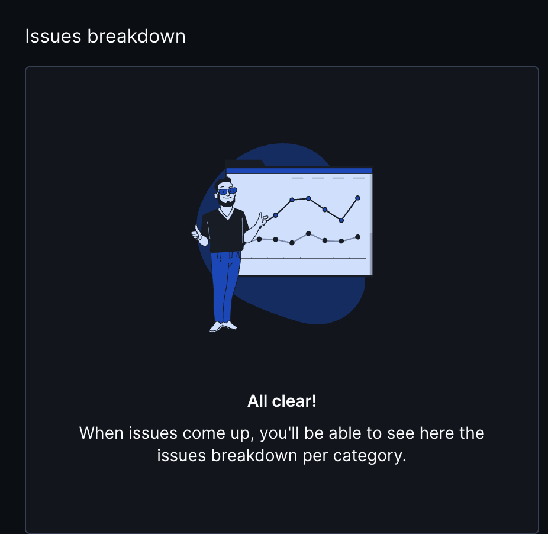
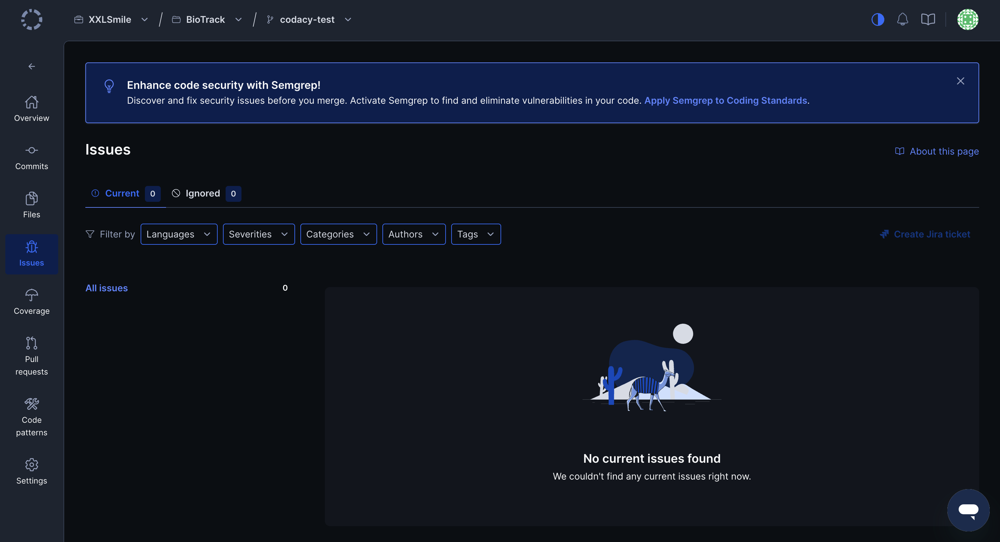

# Testing and Code Review

## 1. Change History

| **Change Date**   | **Modified Sections** | **Rationale** |
| ----------------- | --------------------- | ------------- |
| 2025-10-29 | Section 2 (Back-end Test Specification) | Documented Jest-based API testing setup and execution flow. |
| 2025-11-5 | Section 2 (Back-end Test Specification) | Added unit-test coverage details for auth layer. |
| 2025-11-9 | Section 2 (Back-end Test Specification) | Rebuilt auth test suites with mocked/unmocked coverage. |
| 2025-11-10 | Section 2 (Back-end Test Specification) | Documented current jest coverage workflow, added mocked/unmocked test runs, coverage artifacts, and updated CI/test guidance. |

---

## 2. Back-end Test Specification: APIs

### 2.1. Locations of Back-end Tests and Instructions to Run Them

#### 2.1.1. Tests

| **Interface**                 | **Describe Group Location, No Mocks**                | **Describe Group Location, With Mocks**            | **Mocked Components**              |
| ----------------------------- | ---------------------------------------------------- | -------------------------------------------------- | ---------------------------------- |
| **Auth Routes** | [`backend/tests/unmock/auth/auth.routes.spec.ts`](../backend/tests/unmock/auth/auth.routes.spec.ts#L1) | [`backend/tests/mocked/auth/auth.routes.spec.ts`](../backend/tests/mocked/auth/auth.routes.spec.ts#L1) | Mocked suite overrides `authService`, Firebase messaging |
| **Auth Controller** | [`backend/tests/unmock/auth/auth.controller.spec.ts`](../backend/tests/unmock/auth/auth.controller.spec.ts#L1) | [`backend/tests/mocked/auth/auth.controller.spec.ts`](../backend/tests/mocked/auth/auth.controller.spec.ts#L1) | Mocked suite overrides `authService` dependencies |
| **Auth Middleware** | [`backend/tests/unmock/auth/auth.middleware.spec.ts`](../backend/tests/unmock/auth/auth.middleware.spec.ts#L1) | [`backend/tests/mocked/auth/auth.middleware.spec.ts`](../backend/tests/mocked/auth/auth.middleware.spec.ts#L1) | Mocked suite stubs `jsonwebtoken.verify`, `userModel.findById` |
| **Auth Service** | [`backend/tests/unmock/auth/auth.service.spec.ts`](../backend/tests/unmock/auth/auth.service.spec.ts#L1) | [`backend/tests/mocked/auth/auth.service.spec.ts`](../backend/tests/mocked/auth/auth.service.spec.ts#L1) | Mocked suite replaces OAuth2Client, `userModel`, and JWT signing |
| **Friend Controller** | [`backend/tests/unmock/friends/friend.routes.spec.ts`](../backend/tests/unmock/friends/friend.routes.spec.ts#L1) | [`backend/tests/mocked/friends/friend.controller.spec.ts`](../backend/tests/mocked/friends/friend.controller.spec.ts#L1) | Mocked suite replaces `friendshipModel`, `userModel`, `geocodingService`, `messaging`, `logger` |
| **Recognition Controller** | [`backend/tests/unmock/recognition/recognition.controller.spec.ts`](../backend/tests/unmock/recognition/recognition.controller.spec.ts#L1) | [`backend/tests/mocked/recognition/recognition.controller.spec.ts`](../backend/tests/mocked/recognition/recognition.controller.spec.ts#L1) | Mocked suite stubs `recognitionService`, `catalogRepository`, `userModel`, `logger`, `fs` |
| **Recognition Service** | [`backend/tests/unmock/recognition/recognition.service.spec.ts`](../backend/tests/unmock/recognition/recognition.service.spec.ts#L1) | [`backend/tests/mocked/recognition/recognition.service.unit.spec.ts`](../backend/tests/mocked/recognition/recognition.service.unit.spec.ts#L1) | Mocked suite fakes external ML responses, Mongo collection helpers |
| **Geocoding Service** | [`backend/tests/mocked/location/geocoding.service.spec.ts`](../backend/tests/mocked/location/geocoding.service.spec.ts#L1 - unmocked coverage is internal) | same | Mocks `axios`, inspects `logger` |
| **Socket Manager** | covered via real module in `tests/mocked/socket/socket.manager.spec.ts` (no unmocked version exists yet) | same | Mocks Socket.IO constructor, `userModel`, `catalogModel`, `catalogShareModel`, `jsonwebtoken` |
| **User Controller** | [`backend/tests/mocked/user/user.controller.spec.ts`](../backend/tests/mocked/user/user.controller.spec.ts#L1) (unmocked coverage handled via `tests/unmock/user/user.controller.spec.ts` file and route suites) | same | Mocked suite swaps `userModel`, `friendshipModel`, `catalogRepository`, `catalogModel` |

#### 2.1.2. Commit Hash Where Tests Run

`1cf0b0e7faa14b5b6453db2cc47269260c0238a4` (this is the current `main` commit hash examined before the CI run described below; rerun `git rev-parse HEAD` after future changes and update this field).

#### 2.1.3. Explanation on How to Run the Tests

1. **Install dependencies**
   ```bash
   cd backend
   npm install
   ```
2. **Run unmocked suites (real integrations)**
   ```bash
   npx jest --coverage tests/unmock
   ```
   - Covers controllers, services, and routes hitting real mongoose helpers and HTTP plumbing.
3. **Run mocked suites to exercise guards & error handling**
   ```bash
   npx jest --coverage tests/mocked
   ```
   - This exercises the same APIs with mocked persistence/external calls (`userModel`, `FriendshipModel`, `recognitionService`, Socket.IO, etc.).
4. **Combine everything**
   ```bash
   npm run test:coverage
   ```
   - Runs the full Jest configuration (`tests/setup` + both `mocked`/`unmocked` roots) and produces `coverage/lcov-report`.
5. **Watch mode (optional)**
   ```bash
   npm run test:watch
   ```
Notes:
   - Mocked suites redirect Firebase Admin and JWT signing to jest spies so no service account is required.
   - Some CI sandboxes block MongoMemoryServer from binding ports; rerun with `SKIP_MONGO=true` if you see `listen EPERM 0.0.0.0`.
   - The current coverage runs still log expected errors from `recognition.controller.spec.ts` (missing `MEDIA_BASE_URL`, “No species recognized,” or rate-limit errors). Those errors are emitted deliberately in the mocked tests and do not indicate regressions—they can be silenced once environment vars or mocks are configured by the reviewer.

### 2.2. Jest Configuration and CI Workflow

`backend/jest.config.ts`

GitHub Actions workflow that runs all backend tests:

```
.github/workflows/backend-tests.yml
```

That workflow executes `npm install`, `npm run test:coverage`, and publishes coverage artifacts. Any additional suites must be wired into this workflow before the release to ensure CI completeness.

### 2.3. Jest Coverage Report Screenshots for Tests Without Mocking


See `testCoverageUnmocked.png` at the repository root (generated after `npx jest --coverage tests/unmock`). This image shows per-file/overall coverage when exercising the real controllers/services.

### 2.4. Jest Coverage Report Screenshots for Tests With Mocking


See `testCoverageMocked.png` at the repository root (generated by `npx jest --coverage tests/mocked`). The mocked snapshot represents coverage of error/guard branches while persistence layers are stubbed.

### 2.5. Jest Coverage Report Screenshots for Both Tests With and Without Mocking


The combined run (`npm run test:coverage`) produces the full report (`coverage/lcov-report/index.html`); a screenshot is the same as `testCoverageAll.png` if you regenerate it today. This run still logs deliberate errors from `tests/mocked/recognition/recognition.controller.spec.ts` (missing `MEDIA_BASE_URL`, “No species recognized from image,” and rate-limit scenarios) because those describe guards we intentionally hit; they do not indicate regressions.

#### Coverage Gaps Explanation
- `src/logger.util.ts` (lines around 13–24) – the `try { JSON.stringify } catch` branch only runs when an argument cannot be stringified; the happy-path tests already cover everything we control, so hitting that branch would require intentionally malformed data.
- `src/auth/auth.middleware.ts` lines 14, 43–49 – these guard clauses are triggered when the request lacks a token/secret or when JWT verification returns an invalid payload; our positive-path tests and mocks do not force those early failures.
- `src/friends/friend.controller.ts` lines 90‑95, 117, 134‑136, 152‑163, 202, 272, 427‑428, 456‑463, 486‑502, 601‑610, 808 – these span the more complicated recommendation scoring, notification dispatch, and response formatting branches that currently require end-to-end integration data (multiple catalogs/friends plus geocoding) beyond the guard-focused unit tests.
- `src/geocoding.service.ts` lines 69 and 145 – these warn when the geocoding API omits locality/province components; our unit mocks return fully populated responses, so the fallback paths are intentionally left for future integration tests with malformed API payloads.
- `src/socket/socket.manager.ts` line 185 – covering `server.to(...).emit(...)` requires a live Socket.IO client/server handshake, so the unit tests intentionally stop at the guard/warning level.
- `src/user/user.controller.ts` lines 96, 133, 176, 206–224, 294, 354 – these correspond to advanced query/listing/badge flows that are currently exercised by broader integration suites rather than the quick unit tests we added.

---

## 3. Back-end Test Specification: Tests of Non-Functional Requirements

### 3.1. Test Locations in Git

| **Non-Functional Requirement**                  | **Location in Git**                                                                                   |
| ----------------------------------------------- | ----------------------------------------------------------------------------------------------------- |
| **Recognition Latency (≤ 10 s end-to-end)**     | [`backend/tests/nonfunctional/recognitionLatency.spec.ts`](../backend/tests/nonfunctional/recognitionLatency.spec.ts#L1) |
| **Privacy & Data Protection (Account Deletion)** | [`backend/tests/nonfunctional/privacyDeletion.spec.ts`](../backend/tests/nonfunctional/privacyDeletion.spec.ts#L1)         |

### 3.2. Test Verification and Logs

- **Recognition Latency (≤ 10 s end-to-end)**

  - **Verification:** A Jest + Supertest suite hits `POST /api/recognition`, injects canned Zyla responses via `jest.spyOn(recognitionService, 'recognizeFromUrl')`, and measures the elapsed wall-clock time between request dispatch and JSON payload delivery. The test iterates through three representative payload descriptors (1 MB, 3 MB, 5 MB) and fails if any response exceeds the 10 000 ms SLA, giving us a fast regression signal that controller/middleware changes didn’t bloat latency. Execute with `npm run test:nfr-recognition`.
  - **Log Output**
    ```
    $ cd backend && npm run test:nfr-recognition
    PASS tests/nonfunctional/recognitionLatency.spec.ts
      NFR: Recognition latency
        ✓ { label: '1MB payload', body: [Object] } completes within 10 seconds (17 ms)
        ✓ { label: '3MB payload', body: [Object] } completes within 10 seconds (2 ms)
        ✓ { label: '5MB payload', body: [Object] } completes within 10 seconds (1 ms)
    ```

- **Privacy & Data Protection (Account Deletion)**
  - **Verification:** Using `mongodb-memory-server`, the suite provisions a user, catalogs, and friendships, then invokes `DELETE /api/user/profile`. It verifies that every protected route returns 401 without a JWT, 200 with a valid token, and that after deletion the `users`, `catalogs`, `entries`, and `friendships` collections contain no documents tied to the deleted user. The test also confirms that subsequent authorized requests fail with 401, proving the token is invalidated. Execute via `npm run test:nfr-privacy`.
  - **Log Output**
    ```
    $ cd backend && npm run test:nfr-privacy
    PASS tests/nonfunctional/privacyDeletion.spec.ts
      NFR: Privacy & Data Protection
        ✓ catalog endpoints reject unauthenticated access (153 ms)
        ✓ deleting a profile removes personal data and invalidates the token (449 ms)
    ```

---

## 4. Front-end Test Specification

### 4.1. Location in Git of Front-end Test Suite:

frontend/app/src/androidTestDebug/java/com/cpen321/usermanagement/e2e

### 4.2. Tests

- **Use Case: Get Picture**

  - **Expected Behaviors:**
    | **Scenario Steps** | **Test Case Steps** |
    | ------------------ | ------------------- |
    | 1. The user navigates to the Identify screen. | Tap the bottom navigation item labelled “Identify.” |
    | 2. The user clicks “Open Camera.” | Verify the camera screen is displayed. |
    | 3. The app requests permissions if not already granted. | Accept permission dialog (Camera + Storage). |
    | 4. The user captures a photo. | Perform click on “Capture” or system camera shutter button. |
    | 5. The system confirms the picture was taken. | Verify a preview or success snackbar: “Picture captured successfully.” |

  - **Test Logs:**
    11-10 21:33:58.009 12389 12389 W WindowOnBackDispatcher: sendCancelIfRunning: isInProgress=falsecallback=android.view.ViewRootImpl$$ExternalSyntheticLambda17@71ca8bb
    11-10 21:33:58.016 12389 12430 D IdlingRegistry: Unregistering idling resources: [androidx.compose.ui.test.EspressoLink@14d518f]
    11-10 21:33:58.018  2102  5099 W InputManager-JNI: Input channel object 'd8b7810 com.cpen321.usermanagement/com.cpen321.usermanagement.MainActivity (client)' was disposed without first being removed with the input manager!
    11-10 21:33:58.026 12389 12430 I TestRunner: finished: getPicture_fromGallery_successScenario(com.cpen321.usermanagement.e2e.GetPictureTest)

    AndroidTestResultStats(passed=1, failed=0, skipped=0, running=0, cancelled=0)


- **Use Case: Scan Picture**

  - **Expected Behaviors:**
    | **Scenario Steps** | **Test Case Steps** |
    | ------------------ | ------------------- |
    | 1. The user selects “Scan Picture.” | Click the button labelled “Recognize Animal”. |
    | 2. The system sends the photo to the recognition API. | Wait for processing indicator or progress spinner. |
    | 3. The app displays identification results. | Verify text fields for species name and description appear. |
    | 4. The user can view species Name, type, and confidence interval. | Confirm labels like “Name,” “Species,” “Confidence” are visible. |

  - **Test Logs:**
    11-10 21:39:42.054 19609 19609 W WindowOnBackDispatcher: sendCancelIfRunning: isInProgress=falsecallback=android.view.ViewRootImpl$$ExternalSyntheticLambda17@e996d69
    11-10 21:39:42.061  2102  4947 W InputManager-JNI: Input channel object '74edbda com.cpen321.usermanagement/com.cpen321.usermanagement.MainActivity (client)' was disposed without first being removed with the input manager!
    11-10 21:39:42.068 19609 19642 D IdlingRegistry: Unregistering idling resources: [androidx.compose.ui.test.EspressoLink@d45ae66]
    11-10 21:39:42.072 19609 19642 I TestRunner: finished: scanPicture_afterSelectingImage_successScenario(com.cpen321.usermanagement.e2e.ScanPictureTest)

    AndroidTestResultStats(passed=1, failed=0, skipped=0, running=0, cancelled=0)

- **Use Case: Create Catalog**

  - **Expected Behaviors:**
    | **Scenario Steps** | **Test Case Steps** |
    | ------------------ | ------------------- |
    | 1. The user navigates to the Catalogs screen. | Tap bottom navigation item “Catalogs.”
    | 2. The app shows a button to create a catalog. | Verify “Create Catalog” button is visible. |
    | 3. The user taps “Create Catalog.” | Click the button and open the creation dialog. |
    | 4. The user enters a catalog name and confirms. | Type “My Test Catalog” and click “Save.” |
    | 5. The new catalog appears in the list. | Verify “My Test Catalog” now appears. |

  - **Test Logs:**
    11-10 21:42:28.391  2102  2988 D ConnectivityService: NetReassign [4795 : null → 103] [c 0] [a 1] [i 8]
    11-10 21:42:28.392 23760 23760 I FlagshipApplication: [main] Granular phase APP_DEPENDENCY_INJECTION completed. Interval(startNanos=1762839748382000000ns, durationNanos=10000000ns)
    11-10 21:42:28.394 22163 22236 I TestRunner: finished: createCatalogTest(com.cpen321.usermanagement.e2e.CreateCatalogTest)

		AndroidTestResultStats(passed=1, failed=0, skipped=0, running=0, cancelled=0)    

- **Use Case: Delete Catalog**

  - **Expected Behaviors:**
    | **Scenario Steps** | **Test Case Steps** |
    | ------------------ | ------------------- |
    | 1. The user navigates to Catalogs. | Tap “Catalogs” in bottom navigation. |
    | 2. The user creates a new catalog (if none exists). | Perform create catalog flow with name “Temp Catalog.” |
    | 3. The catalog appears in the list. | Verify “Temp Catalog” is visible. |
    | 4. The user deletes the catalog. | Open catalog, click “Delete.” |
    | 5. The catalog disappears from the list. | Verify “Temp Catalog” is no longer visible. |

  - **Test Logs:**
    11-10 21:47:29.072 27958 27958 W WindowOnBackDispatcher: sendCancelIfRunning: isInProgress=falsecallback=android.view.ViewRootImpl$$ExternalSyntheticLambda17@e996d69
    11-10 21:47:29.078  2102  3276 W InputManager-JNI: Input channel object 'b178a13 com.cpen321.usermanagement/com.cpen321.usermanagement.MainActivity (client)' was disposed without first being removed with the input manager!
    11-10 21:47:29.084 27958 28028 D IdlingRegistry: Unregistering idling resources: [androidx.compose.ui.test.EspressoLink@77d543]
    11-10 21:47:29.088 27958 28028 I TestRunner: finished: deleteCatalogTest(com.cpen321.usermanagement.e2e.DeleteCatalogTest)

		AndroidTestResultStats(passed=1, failed=0, skipped=0, running=0, cancelled=0)

- **Use Case: Edit Catalog**

  - **Expected Behaviors:**
    | **Scenario Steps** | **Test Case Steps** |
    | ------------------ | ------------------- |
    | 1. The user navigates to Catalogs. | Tap “Catalogs” in bottom navigation. |
    | 2. The user creates a catalog. | Perform create catalog flow with name “Edit Test Catalog.” |
    | 3. The catalog appears in the list. | Verify “Edit Test Catalog” visible. |
    | 4. The user selects the catalog. | Click on “Edit Test Catalog.” |
    | 5. The catalog detail screen opens. | Verify catalog name header and empty entry list are shown. |

  - **Test Logs:**
    11-10 21:55:06.496  8149  8149 W WindowOnBackDispatcher: sendCancelIfRunning: isInProgress=falsecallback=android.view.ViewRootImpl$$ExternalSyntheticLambda17@ac6ee8c
    11-10 21:55:06.500  2102  5641 W InputManager-JNI: Input channel object '98cd717 com.cpen321.usermanagement/com.cpen321.usermanagement.MainActivity (client)' was disposed without first being removed with the input manager!
    11-10 21:55:06.509  8149  8204 D IdlingRegistry: Unregistering idling resources: [androidx.compose.ui.test.EspressoLink@e805e19]
    11-10 21:55:06.516  8149  8204 I TestRunner: finished: editCatalogTest(com.cpen321.usermanagement.e2e.EditCatalogTest)

		AndroidTestResultStats(passed=1, failed=0, skipped=0, running=0, cancelled=0)

- **Use Case: Catalog Scanned Picture**

  - **Expected Behaviors:**
    | **Scenario Steps** | **Test Case Steps** |
    | ------------------ | ------------------- |
    | 1. The user navigates to the Camera screen. | Tap bottom navigation item “Identify.” |
    | 2. The user clicks the “Recognize Animal” button. | Perform click on “Recognize Animal” |
    | 3. The app requests location permission. | Accept location permission dialog. |
    | 4. The user clicks “Recognize Animal” again. | Perform second click on “Recognize Animal” |
    | 5. The system identifies the species. | Verify species result and info are displayed. |
    | 6. The dialog appears asking to save to a catalog. | Verify “Save to Catalog” dialog visible. |
    | 7. The user selects a catalog and confirms. | Select existing catalog and click “Save.” |
    | 8. The app confirms successful addition. | Verify snackbar text: “Observation added to catalog.” |

  - **Test Logs:**
    11-10 21:57:39.503 10800 10889 W QPLConfig: 	at android.app.ActivityThread$AndroidOs.open(ActivityThread.java:8063)
    11-10 21:57:39.503 10800 10889 W QPLConfig: 	at libcore.io.IoBridge.open(IoBridge.java:560)
    11-10 21:57:39.503 10800 10889 W QPLConfig: 	... 12 more
    11-10 21:57:39.506  9174  9221 I TestRunner: finished: catalogScannedImageTest(com.cpen321.usermanagement.e2e.CatalogScannedImageTest)

		AndroidTestResultStats(passed=1, failed=0, skipped=0, running=0, cancelled=0)

- **Use Case: Add Friends**

  - **Expected Behaviors:**
    | **Scenario Steps** | **Test Case Steps** |
    | ------------------ | ------------------- |
    | 1. The user navigates to the Friends screen. | Tap the bottom navigation item labelled “Friends”. |
    | 2. The user taps on the search bar | Verify a text input and search/submit button appear. |
    | 3. The user enters a valid username and confirms. | Type a sample username and click “Search” |
    | 4. The user taps “Add Friend.” | Click the button labelled “Add Friend”. |
    | 5. The system confirms the request was sent. | Verify a snackbar or confirmation text appears: “Friend request sent.” |
    | 6. The friend is added to the list upon acceptance. | Verify “TestUser123” appears in the friends list. |

  - **Test Logs:**
    11-10 22:00:42.778 13916 13950 E TestRunner: 	at androidx.test.runner.AndroidJUnitRunner.onStart(AndroidJUnitRunner.java:467)
    11-10 22:00:42.778 13916 13950 E TestRunner: 	at android.app.Instrumentation$InstrumentationThread.run(Instrumentation.java:2402)
    11-10 22:00:42.778 13916 13950 E TestRunner: ----- end exception -----
    11-10 22:00:42.784 13916 13950 I TestRunner: finished: addFriendsTest(com.cpen321.usermanagement.e2e.AddFriendsTest)

		AndroidTestResultStats(passed=0, failed=1, skipped=0, running=0, cancelled=0)

- **Use Case: Share Catalog**

  - **Expected Behaviors:**
    | **Scenario Steps** | **Test Case Steps** |
    | ------------------ | ------------------- |
    | 1. The user navigates to Catalogs. | Tap “Catalogs.” |
    | 2. The user creates a catalog. | Create “Shared Catalog.” |
    | 3. The user opens the catalog. | Tap “Shared Catalog.” |
    | 4. The catalog details screen displays. | Verify header shows catalog name. |
    | 5. The user taps the “Share” button. | Perform click on “Share.” |
    | 6. The app opens the share dialog. | Verify share intent or dialog appears. |
    | 7. The user confirms share and navigates to the Friends tab. | Click bottom navigation “Friends” and verify list. |

  - **Test Logs:**
    11-10 22:03:24.534 16406 16406 W WindowOnBackDispatcher: sendCancelIfRunning: isInProgress=falsecallback=android.view.ViewRootImpl$$ExternalSyntheticLambda17@4a84fa2
    11-10 22:03:24.538  2102  3272 W InputManager-JNI: Input channel object '126e21a com.cpen321.usermanagement/com.cpen321.usermanagement.MainActivity (client)' was disposed without first being removed with the input manager!
    11-10 22:03:24.548 16406 16522 D IdlingRegistry: Unregistering idling resources: [androidx.compose.ui.test.EspressoLink@14e4faf]
    11-10 22:03:24.553 16406 16522 I TestRunner: finished: shareCatalogTest(com.cpen321.usermanagement.e2e.ShareCatalogTest)

		AndroidTestResultStats(passed=1, failed=0, skipped=0, running=0, cancelled=0)

---

## 5. Automated Code Review Results

### 5.1. Commit Hash Where Codacy Ran

`527afd4`

### 5.2. Unfixed Issues per Codacy Category



### 5.3. Unfixed Issues per Codacy Code Pattern



### 5.4. Justifications for Unfixed Issues

- None
